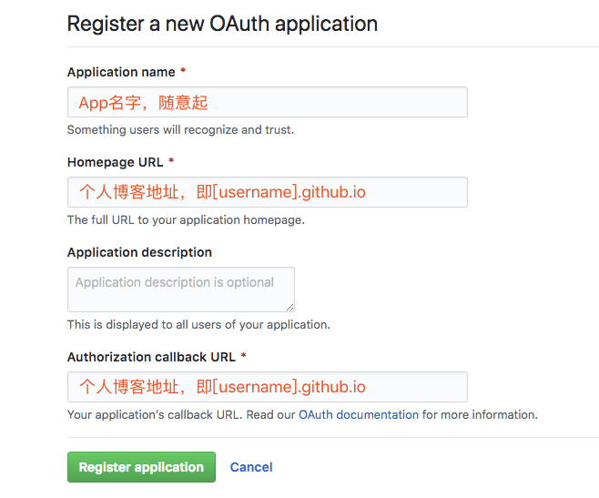

### **为什么要用Github Pages**
大概每个人都想拥有一个自己的个人主页，建站方式从一点点写原生代码到直接购买博客网站的服务有很多很多的选择。我以前也尝试过用React + Flask + MySQL + AWS搞一套完完全全自己写的网站，但是刚刚开始搞前端遇到了点webpack的坑就做不下去了，工程量和维护量都太大了。而简书等博客网站又无法自由自在的定制功能和界面，限制很多，服务器容量小，未来还可能会收费。在调研了很多建站的方式后，我选择了Github Pages + Jekyll。

如何做选择？其实主要还是要明确个人需求，比如建站目的，博客内容的偏好，维护的精力，成本大小等等。Github Pages + Jekyll的优势在于：免费，部署方便，稳定性好，插件齐全，自由度高，配套工具好用。另外要明确的是，内容才是网站的核心，坚持更新维护要比建站更重要。

### **技术栈**
**Github Pages** \
相当于一个部署极其方便的免费服务器，自动渲染静态网页。[官网](https://pages.github.com/)

**Jekyll** \
Github开发的简单的博客框架，只用Markdown文件直接生成静态网站。Ruby-based。[官网](https://www.jekyll.com.cn/)

**Gitalk**\
Github的一个App，提供博客中的评论功能，用项目下的issues实现。[官网](https://github.com/gitalk/gitalk)

**Atom**\
Github开发的跨平台文本编辑器，完美支持Markdown，用于写博客。[官网](https://atom.io/)\
\
\
前端的布局和样式是在别人的项目的基础上修改的，暂时没有用到复杂的效果，未来可以根据需求添加，目测Github Pages是支持js的。


### **开始**
Github Pages是完全依赖于Github的工具。所以必要条件是必须要有Github账号并熟悉Git的流程。

如果想从头定制，那么参照Github Pages和Jekyll的文档一步步来即可。我为了省下一些设计工作，直接fork了‘码志’（感谢mzlogin）的代码并逐步修改成了自己的。首先fork mzlogin的Github Pages项目 https://github.com/mzlogin/mzlogin.github.io

按照 GitHub Pages 的规定，名称为 [username].github.io 的项目的 master 分支，或者其它名称的项目的 gh-pages 分支可以自动生成 GitHub Pages 页面。所以要将你fork的repo的项目名修改为上述格式。

搭建完成了！现在在地址栏输入https://[username].github.io就是你的主页地址了，就是这么简单，接下来的工作就是修改内容了。以后每次修改内容后push到这个repo就可以直接完成对网站的更新。当然如果想绑定自己的域名，只需要修改CNAME文件的内容即可。

### **评论功能**
接下来是配置评论功能，选择很多，我用的是Gitalk，因为不会被墙。Gitalk是利用Github issue开发的博客评论插件，在一篇文章下评论时，Gitalk会自动在项目下建立一个文章标题的Issue，评论就相当于在Issue下提问题。

Gitalk在使用之前需要创建一个Gitalk App，[点击创建](https://github.com/settings/applications/new)。



创建成功后，Github会返回给你Client ID和Client Secret，然后需要在项目下_config.yml中配置gitalk。
``` yml
# ---------------- #
#      Comments    #
# ---------------- #
comments_provider: gitalk
gitalk:
    owner: [username]
    repo: [username].github.io
    clientID: [your Client ID]
    clientSecret: [your Client Secret]
```
将项目push到远端后，文章下面就可以看到评论框了。有一点小不爽的是，每篇文章都要在评论框中登录一次你的Github账号才可以创建issue，相当于每篇文章都要激活一下才可以使用评论功能。回复可以选择匿名或登录Github账号。

### **搭建本地开发环境**
如果想修改内容布局和样式，不可能每次测试修改都push一次，一定是要有本地的开发环境的。下面介绍如何搭建本地的开发环境，步骤参考[官方文档](https://help.github.com/articles/setting-up-your-github-pages-site-locally-with-jekyll/#step-2-install-jekyll-using-bundler)。

Jekyll是Ruby写的博客框架，要求本地必须装有Ruby 2.1.0 以上的版本。\
gem是ruby的包管理器，相当于python的pip或者node.js的npm，一般装好的Ruby会自带gem。\
bundler是gems的依赖管理工具，若没有先安装bundler。
```sh
gem install bundler
```
然后在项目根目录下添加Gemfile（如果是fork的mzlogin项目应该已经有了），内容为
```sh
source 'https://rubygems.org'
gem 'github-pages', group: :jekyll_plugins
```
在根目录下运行
```sh
bundler install
```
bundler会自动将Jekyll相关的所有依赖装好，需要等待几分钟。装好后运行
```sh
bundle exec jekyll serve
```
即开启Jekyll服务器并自动部署服务，每次修改后支持热部署。\
默认的地址是 http://127.0.0.1:4000， 用浏览器打开就可看到本地环境下的网站效果了。开始修改吧！

### **第一篇博客**
Jekyll的文档简单易懂，这里只说一下如何发布你的第一篇博文。更多的细节参考[官方文档](https://www.jekyll.com.cn/)。

Jekyll原生支持将markdown格式（或Textile格式）的文本文件转化为博文，项目中的_post文件夹是所有博文的目录。未来可以自定义子分页的目录。发表新文章时，在_post目录下创建文件，文件名为
```
年-月-日-标题.MARKUP
```
在这里，年是4位数字，月和日都是2位数字。MARKUP扩展名代表了这篇文章是用什么格式写的，支持.md和.textile。

所有博客文章顶部必须有一段YAML头信息，可以设置一些预定义或自定义的变量，格式如下
```yml
---
layout: post
title: 使用Atom作为Markdown文本编辑器的配置
categories: Technology
description: Atom的Markdown功能相关配置
keywords: Atom, Markdown
---
```
预定义的变量在官方文档里有介绍，自定义的变量都会在数据转换中通过 Liquid 模板被调用。例如，在头信息中你设置一个 title，然后就可以在你的模板中使用这个 title 变量来设置页面的 title属性 ：
```html
<!DOCTYPE HTML>
<html>
  <head>
    <title>{{ page.title }}</title>
  </head>
  <body>
    ...
```
头信息下面就是你的博客内容了，可以选择一个友好的Markdown编辑器来编写文章，我选择的是Atom加上各种Markdown的插件，具体配置可以参见我的文章[使用Atom作为Markdown文本编辑器的配置](https://minghao23.github.io/2019/02/01/Atom/)。

将文件保存为md格式并确保放在_post下，你的第一篇博文就发表好了。其实除了博文外，网站中的很多其他内容也是用markdown编写的，项目里的文件不多，把每个文件的功能都了解一下，就可以实现真正自定义的个人网站了。比较好修改的部分有_config.yml里的个人信息，还有pages目录下每个页面的内容。另外记得删除原博主的信息和博文。

更进阶的部分就是修改网页的布局和样式了，所有的css和js文件都存在assets目录下，对前端熟悉的同学可以根据自己的需求尽情修改。

所有修改完成后，git push到远端，你的第一篇博文就正式发表了！从现在起，坚持更新内容吧。
